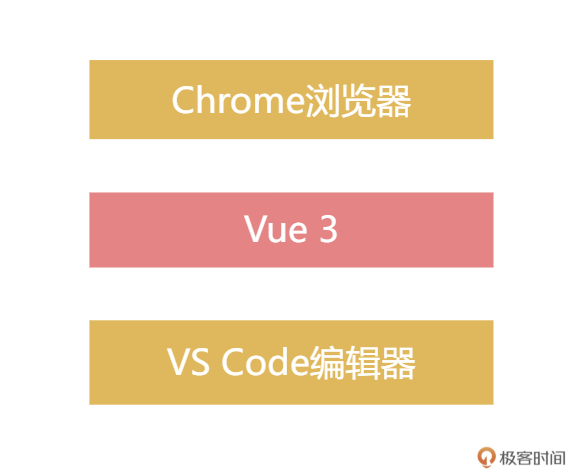
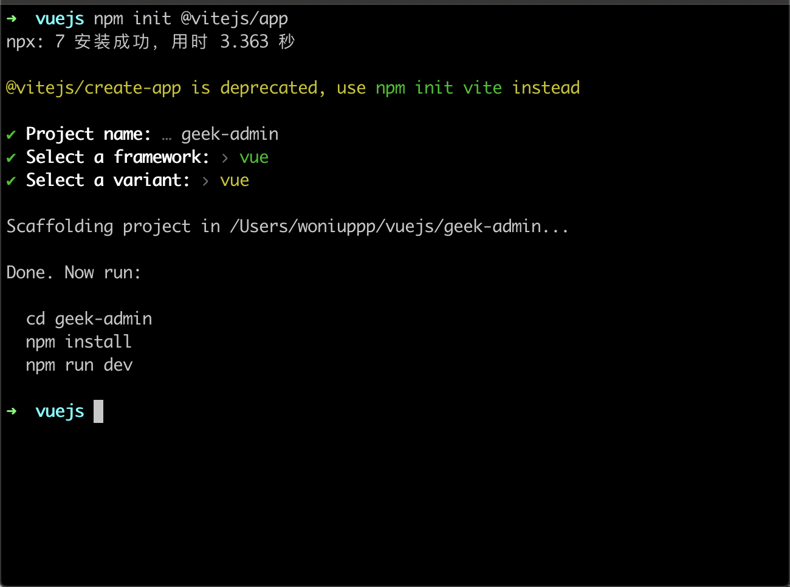
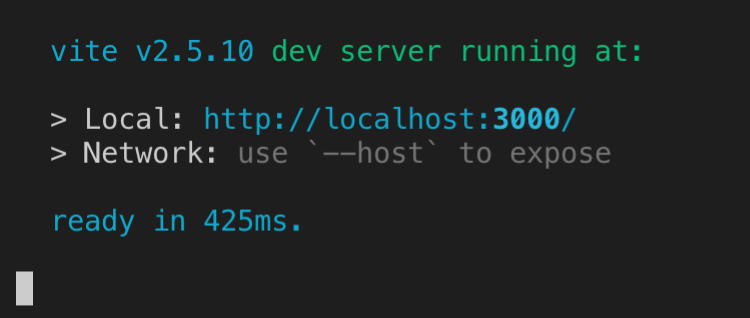
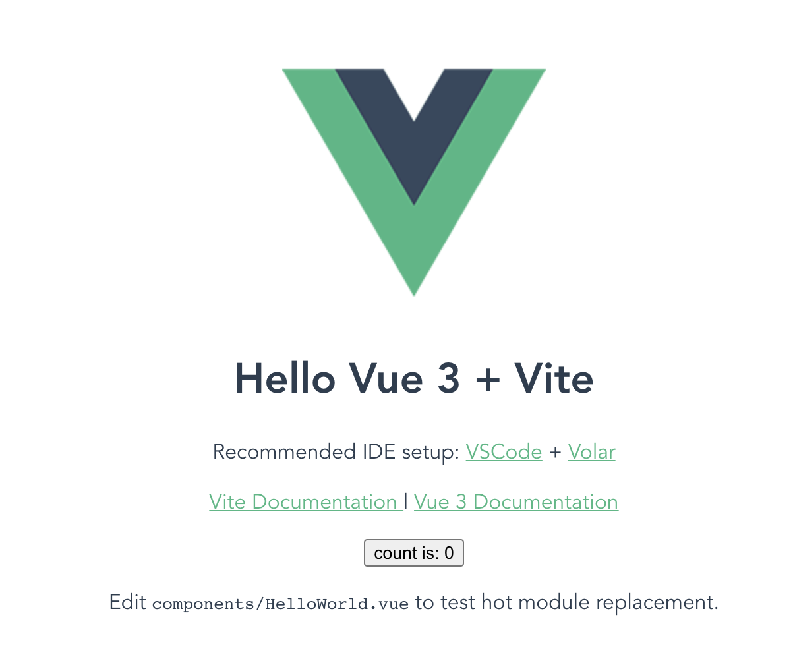
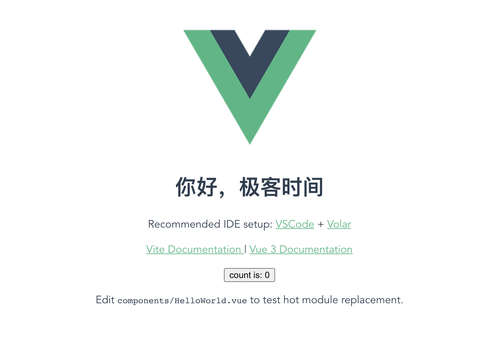
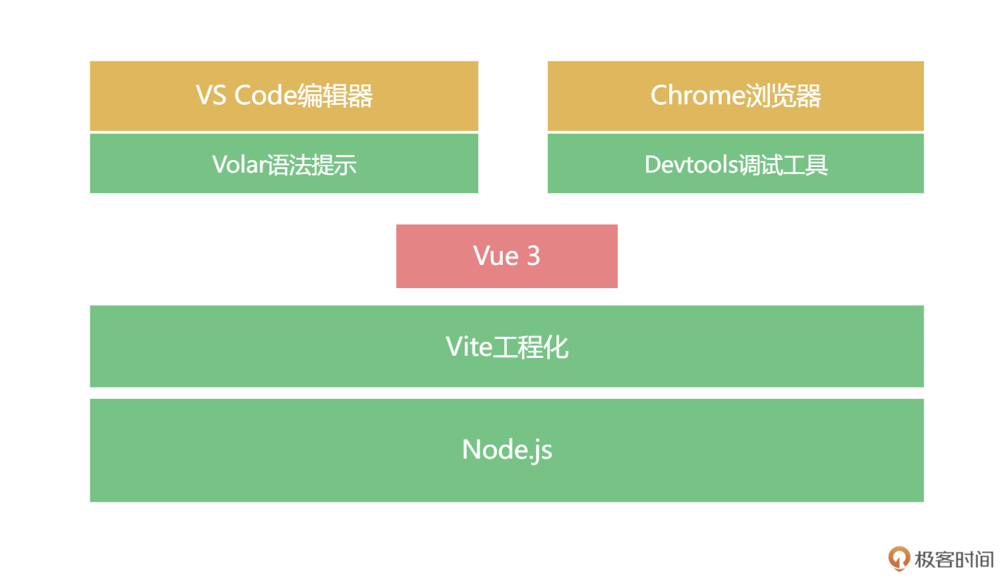
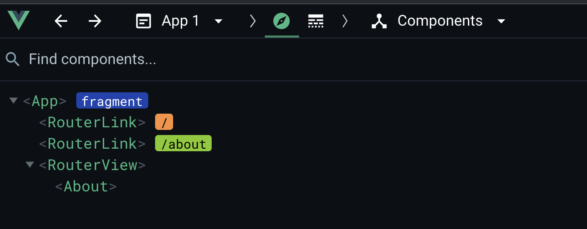
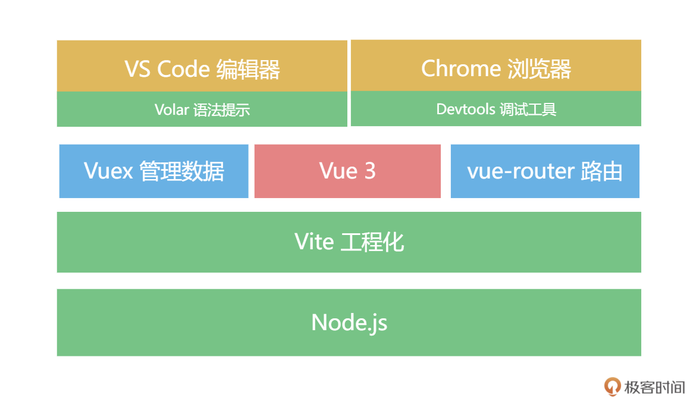
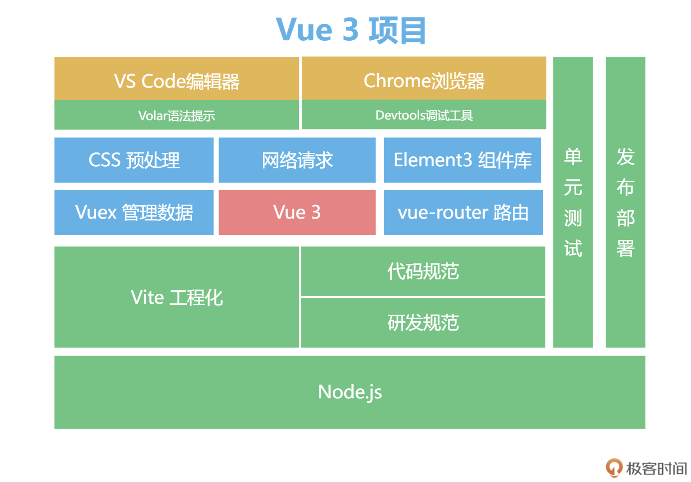

# 05 | 项目启动：搭建Vue 3工程化项目第一步
你好，我是大圣，欢迎进入课程的第二部分——基础入门篇。

在课程导读篇，我们了解了Vue 3 的新特性以及从Vue 2升级到Vue 3 的方法。相信你现在已经和小圣同学一样，迫不及待地想做一个实际的项目。当然了，在实战中学习Vue 3也是最好并且最快的学习方式。

不过，你先别着急。在基础入门篇，我会用5讲的篇幅，带你学习Vue 3的核心功能，包括 **项目搭建、Composition API、响应式、组件化和动画**。这5讲结束后，你就会对Vue 3的核心功能有一个整体的了解，为我们全家桶实战篇的学习打下坚实的基础。

实际开发中，除了Vue 3这个库，我们还需要Vue 3 的最新全家桶，也就是Vue 3的周边生态，这其实就和士兵需要武器装备是一样的。今天这次，我会手把手带你安装和构建Vue 3开发环境。

## 环境准备

在之前的语法演示中，我们直接使用script 引入Vue 3，从而在浏览器里实现了所有调试功能。但是在实际的项目中，我们会使用专门的调试工具。在项目上线之前，代码也需要打包压缩，并且考虑到研发效率和代码可维护性，所以在下面，我们需要建立一个工程化的项目来实现这些功能。

你能在下图中看到我们现在要用到的工具，VS Code写Vue 3的代码，直接在Chrome浏览器里展示，我们会在这个基础之上逐步添加新的工具。



对于Vue 2，官方推荐用Vue-cli创建项目；而对于Vue 3，我建议你使用Vite创建项目，因为vite能够提供更好更快的调试体验。在使用Vite之前，我们要先安装Node.js 。

下载安装Node.js的过程是傻瓜式的，直接去 [Node.js官网](http://nodejs.cn/download/) 下载安装即可。下载的时候，我们可以选择LTS版本，也就是稳定版，进行下载和安装即可。安装完毕后，我们创建vuejs工作目录，然后在命令行窗口执行node -v 指令，如果看到如下界面就算安装成功啦。


之后，我们就可以在VS Code里进行Vue项目的开发。不过，在正式开发之前，我推荐使用VS Code的官方扩展插件Volar，这个插件给Vue 3提供了全面的开发支持。我们访问Volar的 [地址](https://marketplace.visualstudio.com/items?itemName=johnsoncodehk.volar)，直接点击Install，就会启动VS Code并且安装。然后使用Chrome访问 Vue 3调试插件的 [地址](https://chrome.google.com/webstore/detail/vuejs-devtools/ljjemllljcmogpfapbkkighbhhppjdbg?hl=en) ，可以帮助我们在浏览器里高效的调试页面。

接下来，在命令行窗口里，我们对vuejs目录执行下面的命令，这样就可以创建一个Vite的初始化项目。

```diff
npm init @vitejs/app

```

之后，在Project name这一行，我们输入项目的名字，例如geek-admin；接着，在Select a framework这一行输入框架的名字，这里我们选择vue；再之后，在select a variant 这一行，因为在项目里，我们没有选择TS，所以这里我们依然选择vue即可。



我们看一下geek-admin下面的文件目录，这个目录就是我们项目启动的骨架了。目录中的index.html是项目的入口；package.json是管理项目依赖和配置的文件；public目录放置静态资源，比如logo等图片；vite.config.js就是和Vite相关所有工程化的配置；src就是工作的重点，我们大部分的代码都会在src目录下管理和书写，后面我们也会在src目录下细化项目规范。

```diff
.
├── README.md
├── index.html           入口文件
├── package.json
├── public               资源文件
│   └── favicon.ico
├── src                  源码
│   ├── App.vue          单文件组件
│   ├── assets
│   │   └── logo.png
│   ├── components
│   │   └── HelloWorld.vue
│   └── main.js          入口
└── vite.config.js vite工程化配置文件

```

在这之后，我们在geek-admin文件夹内执行npm install 命令，来进行依赖的安装，然后执行npm run dev 命令来启动项目，看到如下信息就算是启动成功了。



我们根据命令行中的提示，在Chrome里打开 [http://localhost:3000/](http://localhost:3000/)，看到如下图所示的页面时，我们第一步就完成了。



完成了项目的初始化之后，下一步我们会细化src目录，搭建源码的骨架架构。我们去VS Code里打开项目，修改一下src目录下的App.vue 文件。例如，我们改动一下文件中的HelloWorld组件，把msg改成“你好，极客时间”，之后你会发现浏览器不需要我们去刷新，首页大标题就自动更新了，这种热更新的开发体验会伴随我们整个项目开发，极大提高我们的开发效率。



现在，项目的架构是下图所示的这个样子，这样我们的项目就拥有了工程化的雏形。我们来从下往上看这个架构： **我们所有工程化体系都是基于Node.js生态；我们使用VS Code+Volar编辑器+语法提示工具作为上层开发工具；使用Vite作为工程化工具；使用Chrome进行调试**，这些都是Vue 3工程化体系的必备工具。



由于小圣还不熟悉TypeScript，这里我们就依然使用JavaScript来开发，方便学习。关于如何使用TypeScript开发Vue 3，我们会在课程的第十四讲中详细地讲到。

我们开发的项目是多页面的，所以vue-router和Vuex也成为了必选项，就像一个团队需要人员配比，Vue负责核心，Vuex负责管理数据，vue-router负责管理路由。我们在geek-admin目录中使用下面这段代码安装Vuex和vue-router。

```diff
npm install vue-router@next vuex@next

```

框架搭建完毕后，我们如何在项目的src目录下面组织我们的路由和其他代码呢？我们需要制定一些基本的规范，最常见的规范就是使用文件夹来做区分。对于如何做分区，下面的规范这一部分就会介绍到。

## 规范

无规矩不成方圆，团队项目中的规范尤其重要。我们先对几个文件夹的分层进行规定，便于管理，下面是src目录的组织结构。

```diff
├── src
│   ├── api            数据请求
│   ├── assets         静态资源
│   ├── components     组件
│   ├── pages          页面
│   ├── router         路由配置
│   ├── store          vuex数据
│   └── utils          工具函数

```

我们的页面需要引入路由系统，我们进入到router文件夹中，新建index.js，写入下面的代码：

```diff
import {
    createRouter,
    createWebHashHistory,
  } from 'vue-router'
  import Home from '../pages/home.vue'
  import About from '../pages/about.vue'

  const routes = [
    {
      path: '/',
      name: 'Home',
      component: Home
    },
    {
      path: '/about',
      name: 'About',
      component: About
    }
  ]

  const router = createRouter({
    history: createWebHashHistory(),
    routes
  })

  export default router


```

上面的代码中，我们首先引入了createRouter和createWebHashHistory两个函数。createRouter用来新建路由实例，createWebHashHistory用来配置我们内部使用hash模式的路由，也就是url上会通过 `#` 来区分。

之后在上面的代码里，我们引入两个组件about和home，根据不同的访问地址 `/` 和 `/home` 去渲染不同的组件，最后返回router即可。

现在页面就会报错，提示我们找不到about和home这两个组件，然后我们去pages下面新建两个文件，分别输入如下内容：

```diff
<template>
    <h1>这是关于页面</h1>
</template>

```

```diff
<template>
    <h1>这是首页</h1>
</template>

```

注意，这两个文件是以 `.vue` 作为后缀的，这是Vue中单文件组件的写法，我们可以在一个文件中通过template、script和style来维护Vue组件的HTML、JavaScript和CSS。然后我们在main.js中，加载router的配置：

```diff
import { createApp } from 'vue'
import App from './App.vue'

import router from './router/index'
createApp(App)
    .use(router)
    .mount('#app')

```

然后去App.vue中，我们删掉template之前的代码，加入如下内容：

```diff
<template>
  <div>
    <router-link to="/">首页</router-link> |
    <router-link to="/about">关于</router-link>
  </div>
  <router-view></router-view>
</template>

```

代码中的router-link和router-view就是由vue-router注册的全局组件，router-link负责跳转不同的页面，相当于Vue世界中的超链接a标签； router-view负责渲染路由匹配的组件，我们可以通过把router-view放在不同的地方，实现复杂项目的页面布局。

我们在浏览器中打开 [http://localhost:3000/](http://localhost:3000/)，就会看到下图的页面，点击“关于”和“首页”都会有页面切换的效果。


我们打开Chrome的调试窗，这也是我们以后常用的调试页面，在Vue这个标签页中，能很清晰地看到组件的层级关系。



至此，一个多页面的Vue开发项目雏形就完成了，现在的页面架构变成了下面图示的这样：



当然这样还不够，我们在实际项目开发中还会有各种工具的集成，比如写CSS代码时，我们需要预处理工具stylus或者sass；组件库开发中，我们需要Element3作为组件库；网络请求后端数据的时候，我们需要Axios。

对于团队维护的项目，工具集成完毕后，还要有严格的代码规范。我们需要Eslint和Prettier来规范代码的格式，Eslint和Prettier可以规范项目中JavaScript代码的可读性和一致性。

代码的管理还需要使用Git，我们默认使用GitHub来托管我们的代码。此外，我们还会使用commitizen来规范Git的日志信息。

对于我们项目的基础组件，我们还会提供单元测试来确保代码质量和可维护性，最后我们还会配置GitHub Action来实现自动化的部署。

最后这个项目的架构大概是下面这样，这就是一个足以应对复杂项目开发的架构了：



**项目雏形搭建完毕后，后面用到哪一块就会把哪一块加上，也就是用一个循序渐进的方式学习。** 比如我们下一讲完成一个独立功能的时候，才会把Git规范加上。至此，项目搭建完毕，在下一讲中，我们开启下一步，也就是页面的主体代码编写。

## 总结

我们来总结一下今天学的知识点。首先在环境准备阶段，我们基于Vite 2和Vue 3搭建了我们项目的初始化框架，包含文件规范、工程化、路由和开发的基础配置，后面我们所有的代码都会在这个架构基础之上进行添加。你可以理解环境准备阶段是给Vue 3提供装备的过程，vue-router提供路由的管理、Vuex管理数据流、VS Code+Chrome+Vite则提供了极致的开发调试体验。

之后，在本讲内容的第二部分，我们制定了代码和文件夹规范。后续新增组件就要去src/components目录，新增数据请求就去src/api目录。并且main.js在项目入口对路由数据进行了注册，这样我们就能够通过执行 `npm run dev` 启动这个项目。之后，我们就能看到首页和关于页面，这样项目的雏形我们就搭建完毕。

最后，在第二部分结尾，我还展示了一下整个项目架构的全景图，你能看到，从环境的准备到项目的初始化，再到搭建完成项目雏形，整个项目架构的全景图也在项目开发过程中逐渐完善。

## **思考题**

当然，没有完美的项目结构，那么对于我们目前的项目来说，你觉得还需要新增什么插件和工具吗？

欢迎你在留言区分享你的想法，如果你对这个项目结构还有什么疑问和建议，我们也可以一起讨论。也推荐你把这一讲推荐给你自己的朋友和同事，我们下一讲见！